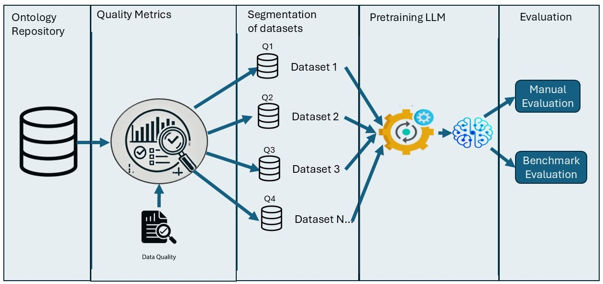

# LLM4Onto: Automated Ontology Quality Assessment and Expansion

LLM4Onto is a framework designed to **evaluate ontology quality** and **generate ontologies using Large Language Models (LLMs)**. The ontology generation process expands upon an **input prompt written in an ontology format**, ensuring that the generated content follows a structured semantic representation. The repository focuses on two main aspects:

1. **Quality Metrics**: Analyzing and selecting high-quality ontologies.
2. **Ontology Generation**: Using an LLM loaded locally or from HuggingFace to expand or generate ontologies, evaluated manually.



---

## 🛠️ Setup and Usage

### **1️⃣ Quality Metrics Computation**
To compute quality metrics for ontologies:
- Start the Docker container using:
  ```sh
  docker compose up -d
  ```
- Execute the quality metrics script inside the container:
  ```sh
  python scripts/quality_metrics/quality_metrics.py
  ```
- This generates an Excel file containing ontology quality scores.

### **2️⃣ Ontology Generation**
To generate ontologies using an LLM loaded locally or from HuggingFace:
- Start the Docker container with GPU support:
  ```sh
  docker compose up -d
  ```
- Run the ontology generation script:
  ```sh
  python scripts/prompt_generation/prompt_gen.py
  ```
- **Input**: `scripts/prompt_generation/prompts.json` defines ontology fragments that guide the model.
- **Output**: Generated ontologies are stored in the `outputs` directory.

### **3️⃣ Benchmark Evaluation**
- The generated ontologies are evaluated using both **manual review** and **benchmark comparisons**.
- Evaluation results are stored in the `results` folder.

---

## 📂 Repository Structure
```
├── data/                # Ontology datasets
│   ├── ontology_repository/   # Full set of ontologies to be processed
│   ├── sample/                # Example ontologies for testing
│
├── docker/              # Docker configuration files
│
├── outputs/             # Generated ontologies and quality metrics
│
├── requirements/        # Dependencies
│
├── scripts/             # Core processing scripts
│   ├── prompt_generation/  # Ontology generation scripts
│   ├── quality_metrics/     # Quality evaluation scripts
│
├── results/             # Processed metrics and evaluations
│
├── image/               # Visual documentation and methodology images
│
├── LICENSE              # Licensing information
├── README.md            # General documentation (this file)
```

---

## 🔍 Additional Notes
- **Three example ontologies** are provided in `data/sample/`, with corresponding outputs.
- The `results/` folder contains **processed metrics from the DBpedia Archivo dataset** with 1,766 ontologies (downloaded on July 15, 2024).
- Each section has its own **detailed README** with further instructions.

